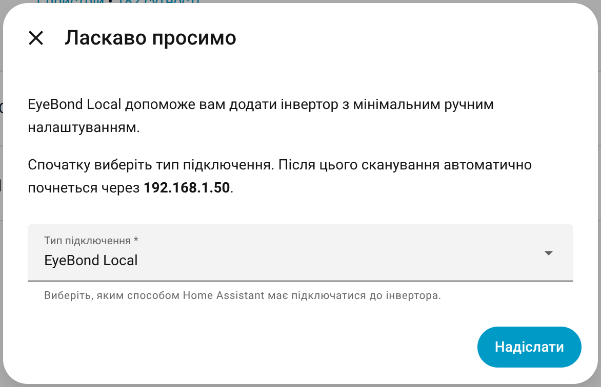
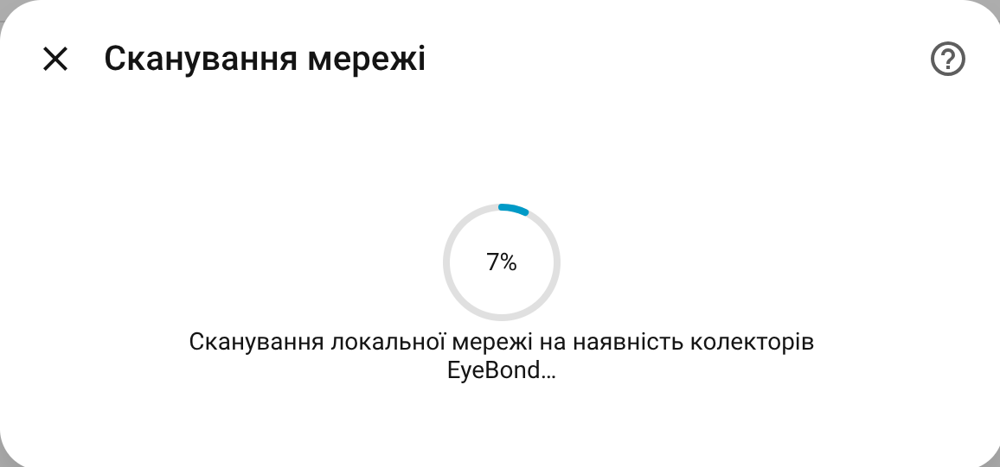
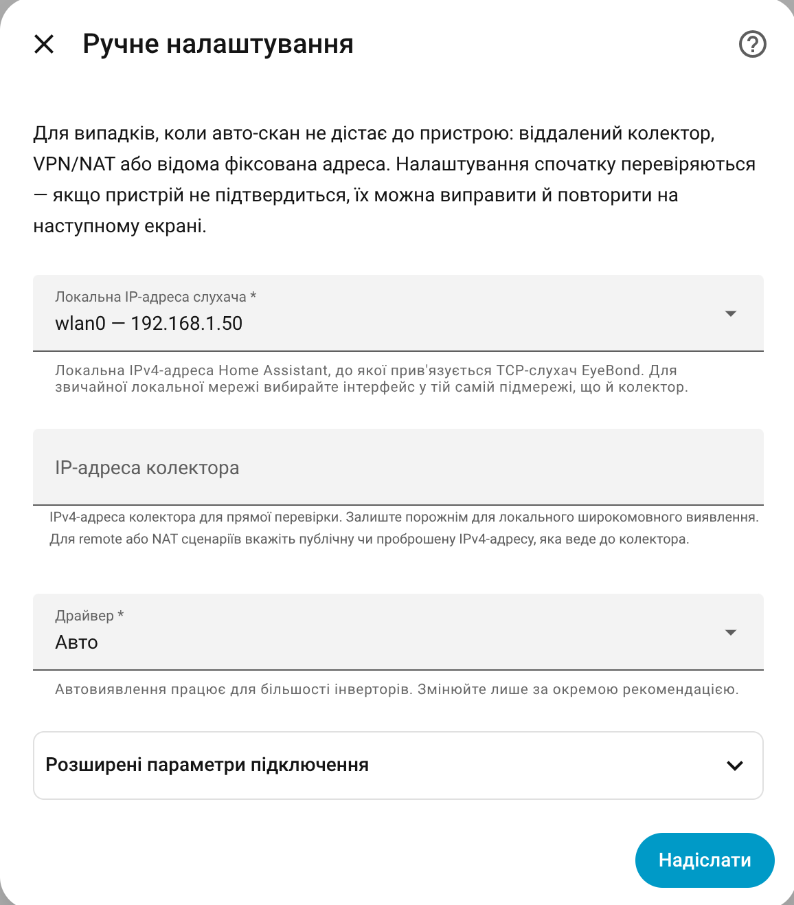
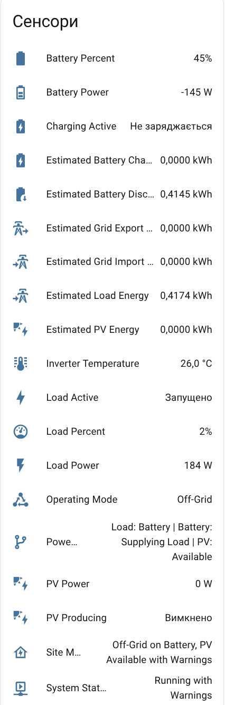
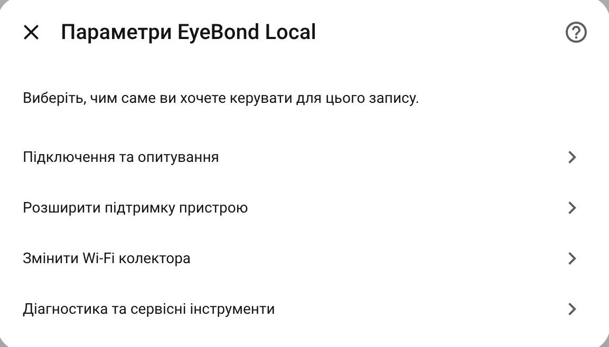

# EyeBond Local

[](https://github.com/hacs/integration)
[](https://www.mozilla.org/en-US/MPL/2.0/)

[Українською](README.uk.md)

[](https://my.home-assistant.io/redirect/hacs_repository/?owner=groove-max&repository=ha-eybond-local&category=integration)

> **Companion dashboard card:** Pair this integration with [EyeBond Local Card](https://github.com/groove-max/ha-eybond-local-card) for a ready-made Lovelace UI with animated power flow and history charts.

**EyeBond Local** is a Home Assistant integration that talks directly to hybrid inverters connected through SmartESS / EyeBond Wi-Fi collectors — without going through the vendor's cloud.

You get live monitoring, energy totals, and gated controls for supported inverters, all over your local network.

If your inverter's stock monitoring already works through the SmartESS app, that's usually the strongest compatibility signal. The stock SmartESS monitoring also typically keeps working in parallel with EyeBond Local.

> **Note:** This integration is in active development. Your inverter may need a Support Archive submission so we can confirm compatibility and decide the right next step. See [Supported Hardware](#supported-hardware) and [Getting Help](#getting-help).

---

## Highlights

- **100% local** — no vendor cloud, no internet dependency.
- **Guided setup wizard** with auto-discovery and a manual fallback.
- **Safe by default** — controls stay read-only until detection is confident.
- **Optional SmartESS cloud assist** — collects reusable cloud evidence for diagnostics and metadata hints without bypassing local safety gates.
- **Explicit write confirmation** — non-action writes must confirm by immediate readback instead of reporting silent success when the value did not stick.
- **Configurable polling interval** — from `2` to `3600` seconds, so updates can be much more frequent than the stock SmartESS refresh.
- **Energy dashboard ready** — derived totals for PV, load, battery, and, on supported models, grid import/export.
- **Open architecture** — JSON-first profiles and register schemas.

---

## Supported Hardware

EyeBond Local works with inverters whose stock monitoring is available through **SmartESS**. This can be an external **SmartESS / EyeBond Wi-Fi collector** or a built-in Wi-Fi module that speaks the same local protocol.

The stock SmartESS monitoring usually keeps working in parallel: EyeBond Local does not replace it or interfere with it.

| Commercial model / hardware class | Internal runtime path | Status | What it means |
|---|---|---|---|
| **Sandisolar SD-HYM-4862HWP** | verified default `modbus_smg` runtime path | Supported | Full monitoring plus tested controls on the verified default SMG layout. In the current runtime UI this device still appears generically as `SMG 6200`, because the local Modbus surface exposes rated power but not a stronger raw commercial identifier. |
| **Anenji ANJ-11KW-48V-WIFI-P** | model-specific `modbus_smg` variant | Supported | Built-in model-specific monitoring is active, including PV1/PV2 telemetry, inverter date/time, and native PV day/total counters. The full write surface has now been verified on real hardware, so tested controls can participate in normal `auto` exposure when detection confidence is high. |
| **Anenji 4200 (Protocol 1)** | model-specific `modbus_smg` variant `anenji_4200_protocol_1` | Partial support | Built-in monitoring follows the document-backed classic SMG protocol-1 layout, including `power_flow_status`, documented identity/config diagnostics, and the shared protocol-1 control surface. Detection remains medium-confidence and built-in writes stay untested, so controls are exposed only in `full` mode until real-hardware validation exists. |
| **PowMr 4.2kW** (raw model `VMII-NXPW5KW`) | `pi30` runtime driver with SmartESS `0925` compatibility metadata | Supported | Full monitoring plus tested controls on the verified PI30-family path for this hardware. |
| **Unknown but clearly SMG-family inverter** | `modbus_smg` `family_fallback` | Read-only fallback | Used when the inverter clearly looks SMG-family but the exact model is not yet verified. Monitoring stays available, support/archive output is explicitly marked as read-only/unverified, and built-in writes remain disabled. |
| **PI18-family hardware** | `pi18` experimental replay path | Experimental | Replay-tested only. Useful for research and fixture work, but there is not yet a verified public hardware model that should be presented as production-ready support. |

Three different naming layers exist in the project, and they should not be read as the same thing:

- **Commercial model name**: the name printed on the inverter, such as `Sandisolar SD-HYM-4862HWP`, `Anenji ANJ-11KW-48V-WIFI-P`, or `PowMr 4.2kW`.
- **Internal runtime path**: the local protocol engine and binding used by the integration, such as `modbus_smg`, `pi30`, or `pi18`.
- **Metadata owner / compatibility profile**: the declarative profile or SmartESS asset used to describe controls and readback, such as SmartESS `0925` compatibility metadata.

The runtime engine may stay generic even when the commercial model is known. For example, the verified Sandisolar unit still runs through the verified default `modbus_smg` runtime path because the local protocol evidence supports that path, but does not expose a trustworthy commercial-name identifier on its own.

Don't see your inverter? It might still work — open an issue with a [Support Archive](#getting-help) and we can evaluate compatibility and, when the protocol matches, extend support.

---

## Installation

### Via HACS (recommended)

1. Open **HACS → Integrations**.
2. Click the menu (three dots) → **Custom repositories**.
3. Add `https://github.com/groove-max/ha-eybond-local` with category **Integration**.
4. Find **EyeBond Local** in the list and click **Download**.
5. Restart Home Assistant.
6. Go to **Settings → Devices & Services → Add Integration** and search for **EyeBond Local**.

### Manual installation

1. Download the latest release.
2. Copy `custom_components/eybond_local/` into your Home Assistant `config/custom_components/` directory.
3. Restart Home Assistant.
4. Add the integration from **Settings → Devices & Services**.

---

## Setup Walkthrough

The setup wizard takes care of most of the work for you.

**1. Welcome** — pick the connection type and confirm to start. The wizard tells you which Home Assistant interface it will scan from.

<p align="center"></p>

**2. Scanning** — the default quick scan sends a broadcast discovery probe on your local network. This usually takes 5–15 seconds. If that quick pass misses your collector, the results screen also offers **Run deep scan**, which keeps the same initial discovery step and then probes the rest of the selected IPv4 network directly.

<p align="center"></p>

**3. Detected devices** — you'll see a list of found collectors and inverters with status badges:

- **Ready** — confidently detected, safe to add.
- **Review** — found but with low confidence.
- **Collector only** — collector responded but the inverter is not yet identified. You can still save it as a read-only Pending Device and continue from diagnostics later.

<p align="center"></p>

**4. Confirm** — review the detected model, serial, and driver in the summary table, then confirm.

<p align="center"></p>

If quick auto-detection doesn't find anything, try **Run deep scan** from the results screen before falling back to **Manual setup**. Deep scan is meant for larger or broadcast-unfriendly networks and can take much longer than the initial quick pass. If you still switch to manual setup, you'll usually need the Wi-Fi module or collector's local IP address; the easiest place to find it is often your router's web UI. Advanced fields (ports, discovery, keep-alive) are tucked into a collapsible section so you only see what you need.

<p align="center"></p>

> **Tip:** Keep Home Assistant and the collector on the **same subnet** if you want auto-discovery, because broadcast discovery usually doesn't cross routers.

### Pending Device / EyeBond Setup Pending

If the wizard can save a usable network path to the collector but cannot fully confirm the inverter yet, it can still create a **read-only Pending Device**. In Home Assistant this appears as **EyeBond Setup Pending**.

This is a saved intermediate state, not automatically a failure.

What it means:

- The integration has saved the listener, discovery, and collector settings you chose.
- The collector may already be known, but the reverse TCP callback, the local inverter match, or both are still incomplete.
- Diagnostics and support actions are available immediately, even if the normal sensors are still unavailable.
- The entry can resolve later on its own after the collector reconnects or after you retry the scan or manual probe.

What to do next:

1. Wait a short moment, then refresh the device page. If the collector was just reconfigured, rebooting it can help.
2. On a normal LAN, keep Home Assistant and the collector on the same subnet, then retry quick scan, deep scan, or manual probe.
3. For manual or remote/NAT setups, re-check the collector IP, advertised callback IP and port, and that TCP `8899` / UDP `58899` are not blocked.
4. If the device stays pending, open **Configure → Diagnostics and experimental metadata** and create a **Support Archive** before editing local drafts.

### Remote / NAT Manual Setup

Most users should leave these advanced fields alone. They are for cases where the collector is remote and must connect back through VPN routing or port forwarding.

Use this feature only when local same-subnet discovery is not enough. If Home Assistant and the collector are on one LAN, leave the advertised callback fields empty.

- **Home Assistant interface / Local listener IP**: the local IPv4 address Home Assistant binds the TCP listener to.
- **Collector IP**: direct IPv4 address used for unicast probing. For remote/NAT setups, use the public or forwarded IPv4 that reaches the collector.
- **Local TCP port**: the TCP listener on Home Assistant. Default: `8899`.
- **Advertised callback IP**: the IPv4 written into `set>server=...`. Leave it empty to advertise the local listener IP. Set it only when the collector must call back through a different VPN/public/NAT-reachable address.
- **Advertised callback TCP port**: the TCP port written into `set>server=...`. Leave it empty to advertise the local TCP port. Override it only when the externally forwarded port is different from the local listener port.
- **UDP discovery port**: the collector discovery redirect port. Default: `58899`.
- **Discovery target**: subnet broadcast for local LAN, or a specific remote/NAT IPv4 for unicast discovery.
- **Discovery interval / Heartbeat interval**: how often Home Assistant re-announces itself and then sends keep-alives after the collector connects.

Need a full walkthrough with examples for VPN and port-forwarding setups? See [Remote / NAT Setup Guide](docs/REMOTE_SETUP.md).

---

## What You Get

After setup, the integration adds a single device with:

- **Sensors** — inverter, PV, battery, and grid measurements (power, voltage, current, temperature, frequency).
- **Polling control** — the sensor refresh interval is configurable from `2` to `3600` seconds in the integration options.
- **Energy totals** — derived `kWh` totals for PV production, load consumption, and battery charge/discharge, plus grid import/export on models that expose grid power. Drop them straight into the **Energy dashboard**.
- **Binary sensors** — operating mode, faults, alarms, charging state.
- **Controls** — `number`, `select`, `switch`, and `button` entities for supported settings (charge limits, output mode, beep, etc.). On variants that ship model-specific tooling, this can also include dedicated actions such as **Sync Inverter Clock**. Control exposure is still gated by detection confidence and validation state, but runtime-only SMG conditions now surface as warnings instead of hiding or locally hard-blocking the control.
- **Diagnostics** — connection state, driver match, support level, collector connection-churn and discovery-restart markers, optional SmartESS cloud evidence export, explicit read-only fallback markers where applicable, and a one-click **Support Archive** export.

<p align="center"></p>

On supported hardware, the settings screen exposes native Home Assistant controls for writable inverter options.

<p align="center"></p>

---

## SmartESS Cloud Assist

When local detection only reaches a collector-only or low-confidence state, EyeBond Local can optionally query SmartESS cloud for the same collector identity and store reusable cloud evidence JSON under `/config/eybond_local/cloud_evidence/`.

- **Credentials are used only for the live fetch** — the integration does not keep a persistent SmartESS cloud login session.
- **Cloud evidence improves diagnostics and metadata planning** — it does not unlock local write controls by itself.
- **Create support archive can reuse saved evidence automatically** or refresh it inline while the ZIP is being built.
- **Export SmartESS cloud evidence** is the standalone advanced action when you want the evidence itself for review or experimental metadata work.
- **Evidence files stay on disk until you remove them manually**. The latest matching file for the entry is reused automatically.

---

## Getting Help

If something doesn't work, the fastest path is:

1. Open the integration's **Configure → Diagnostics and experimental metadata** screen.
2. Click **Create support archive**.
3. Open a [GitHub issue](https://github.com/groove-max/ha-eybond-local/issues) and attach the generated ZIP.

The Support Archive contains an anonymized snapshot of your inverter's state, register reads, and detection results. When matching SmartESS cloud evidence is already saved, the archive includes it automatically, and the same screen can refresh that evidence inline before the ZIP is written. That's usually enough to understand compatibility and decide the next step. If your device turns out to use a different protocol or a non-standard variant, we may need more evidence or more than one iteration before support can be added.

### Issue templates

- **Bug Report** — for reproducible regressions on already-supported hardware.
- **Support Archive / Hardware Diagnostics** — for unsupported hardware, onboarding failures, and partial support. Always attach the generated ZIP.
- **Feature Request** — for new hardware support or UX improvements.

---

## Troubleshooting

| Problem | Try this |
|---|---|
| Auto-scan finds nothing | Use **Change scan interface** to pick a different network interface first. If the quick scan still comes back empty, try **Run deep scan** from the results screen. If you eventually switch to **Manual setup**, find the Wi-Fi module or collector's local IP address first, usually from your router. |
| Device stays on **EyeBond Setup Pending** | A Pending Device is a saved intermediate state, not a hard failure. Wait briefly, retry scan or manual probe, and then create a Support Archive if the collector callback or local match still does not complete. |
| Stuck on "Collector only" | The collector responded, but the integration still can't confidently identify the protocol, profile, or exact inverter model. Submit a Support Archive. |
| Sensors stay unavailable | Check that the collector is on the same subnet as Home Assistant, and that nothing is blocking TCP `8899` / UDP `58899`. |
| A write was accepted but the value immediately reverted | EyeBond Local now treats that as an explicit readback failure instead of silent success. Check the device diagnostics for collector disconnect/restart counters, pause competing SmartESS or vendor-app writes, and retry after the collector is stable. |
| Remote collector replies but never connects back | Check **Advertised callback IP** and **Advertised callback TCP port** first. They must match the address and forwarded TCP port that the collector can really reach. |
| Remote setup is flaky over the public internet | Prefer VPN over raw NAT if either side is behind CGNAT or if UDP/TCP forwarding is unreliable. |
| Controls are missing | In **Auto** mode, controls only appear when detection confidence is high and the relevant capabilities are marked as tested. Some runtime paths are intentionally read-only, such as the SMG family fallback. If monitoring works for a PI30-family inverter but the exact model was not matched, you can open **Runtime settings** and switch to **Full control**. This is a manual safety override that exposes every write command, so use it only at your own risk and preferably after exporting a Support Archive. |

---

## Documentation

- [Documentation index](docs/README.md)
- [Remote / NAT setup guide](docs/REMOTE_SETUP.md) — when and how to use the new callback override fields
- [Adding a new driver / profile](docs/ADDING_DRIVERS.md) — for developers extending hardware support
- [SMG support matrix](docs/SMG_SUPPORT_MATRIX.md)
- [Tools and CLI scripts](tools/README.md)
- [Contributing guide](CONTRIBUTING.md)

---

## Repository Layout

A short orientation for people browsing the source. Full developer notes live in [CONTRIBUTING.md](CONTRIBUTING.md).

- `custom_components/eybond_local/` — integration source code
- `custom_components/eybond_local/profiles/` — declarative capability metadata (JSON)
- `custom_components/eybond_local/register_schemas/` — read-side register layouts (JSON)
- `docs/` — public documentation and generated reports
- `tools/` — CLI utilities for probing, local fixture workflows, and validation
- `.local/fixtures/catalog/` — local replay fixtures kept out of git
- `tests/` — unit and regression tests

---

## Validation

Quick smoke check from the repository root:

```bash
python3 -m unittest discover -s tests -v
python3 tools/quality_gate.py
```

The full developer workflow is in [CONTRIBUTING.md](CONTRIBUTING.md).

---

## License

Licensed under [MPL-2.0](LICENSE) — a deliberate middle ground between permissive and strong-copyleft licenses:

- end users can install, run, fork, and package the integration freely
- if you distribute modified versions of covered files, those file-level changes must remain available under the same license
- friendlier than GPL for Home Assistant users, but less "take and close" than MIT or Apache-2.0
