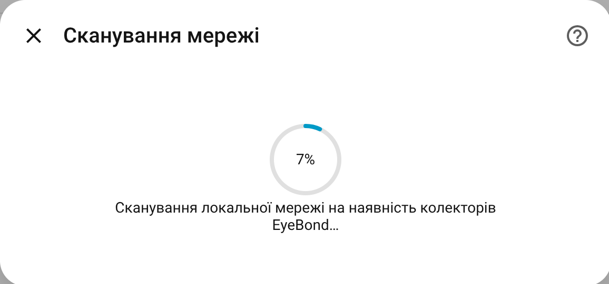

# EyeBond Local — local Home Assistant integration for SmartESS / SmartValue solar inverters

[Українською](README.uk.md)

> The **Open in HACS** button requires HACS to be installed. HACS is optional;
> if you do not use it, follow the manual installation steps below.

> **Companion dashboard card:** [EyeBond Local Card](https://github.com/groove-max/ha-eybond-local-card) adds a ready-made Home Assistant dashboard with power flow and history charts.

> **No factory collector?** [ESP EyeBond Collector](https://github.com/groove-max/esp-eybond-collector) is a community firmware bridge for connecting supported inverters directly to EyeBond Local without a factory cloud logger.

**EyeBond Local** brings local monitoring and control to Home Assistant for hybrid solar inverters that use EyeBond-compatible Wi-Fi collectors and appear in the SmartESS / SmartValue apps.

Use it when your inverter already works in the SmartESS or SmartValue app and you want local LAN access from Home Assistant instead of depending only on the vendor cloud.

It reads live inverter data over your local network. On supported models it can also expose safe controls such as charge settings, output mode, beeper settings, and model-specific switches.

> **Note:** The integration is actively developed. Some inverters work fully, some work in read-only mode, and some need a Support Archive before support can be added.

---

## Is this integration for my inverter?

It may be a good fit if:

- your inverter appears in the SmartESS or SmartValue app;
- it connects through an external or built-in EyeBond-compatible Wi-Fi collector;
- you want Home Assistant to read inverter data locally over your LAN;
- you want PV, battery, load, grid and energy sensors in Home Assistant;
- you want optional local controls on supported, verified models.

People often look for this while searching for SmartESS Home Assistant, SmartValue
Home Assistant, an EyeBond Wi-Fi collector integration, or brands such as Anenji,
PowMr and Sandisolar — and for local solar inverter monitoring without the vendor
cloud. See the full, always-current list in the
[inverter model catalog](docs/generated/INVERTER_MODEL_CATALOG.generated.md).

---

## What it does

- Reads inverter, battery, PV, load, and grid data locally.
- Creates normal Home Assistant sensors, numbers, selects, switches, and buttons.
- Keeps the vendor app working alongside Home Assistant by default, or lets you
  point a collector at Home Assistant only — a reversible, explicit action that
  is never done silently.
- Lets you choose control access:
  - **Read-only** — monitoring only.
  - **Auto** — enable verified controls when the device match is confident.
  - **Full Control** — expose available controls manually for advanced use.
- Can create a **Support Archive** when your device needs diagnostics or new model support.
- Works with the optional [EyeBond Local Card](https://github.com/groove-max/ha-eybond-local-card) dashboard.

---

## Why local instead of the vendor cloud?

EyeBond Local talks to supported collectors over your local network, so day-to-day
monitoring does not depend on the vendor cloud being reachable. Updates arrive at
local speed, and your inverter data stays inside your Home Assistant installation.

On supported collectors you can keep the SmartESS or SmartValue app working at the
same time, or explicitly point a collector at Home Assistant only. Home Assistant
never silently redirects a collector — pointing it at Home Assistant and restoring
its previous server are both explicit, reversible actions.

---

## Supported hardware

EyeBond Local is intended for inverters that use EyeBond-compatible Wi-Fi collectors, including some built-in Wi-Fi modules that behave the same way.

Tested models include units sold as Anenji, PowMr, Sandisolar, LVYUAN, MUST and
Yingfa, plus SMG-, PI18-, PI30- and SRNE-family protocol devices. Support level
varies per model, and other brands on the same collectors may work too.

The current model list is here:

- [Inverter model catalog](docs/generated/INVERTER_MODEL_CATALOG.generated.md)

After the collector is added, runtime detection reports what it identified and
which support level is available:

- **Supported** — normal monitoring and confirmed controls.
- **Limited / partial** — monitoring works, but some controls or sensors may be missing.
- **Read-only** — monitoring works, but controls are disabled.
- **Unknown** — the collector or inverter needs a Support Archive for review.

If your inverter is not listed, it may still work. Add it, create a Support Archive, and open a GitHub issue.

### No factory collector?

If your inverter has no factory collector, you can use the community [ESP EyeBond Collector](https://github.com/groove-max/esp-eybond-collector).

It is a small ESP8266/ESP32-based bridge that connects directly to the inverter and works locally with this integration. Because it does not use a vendor cloud, only local Home Assistant features are available.

---

## Installation

### HACS installation

1. Open **HACS → Integrations**.
2. Click the menu → **Custom repositories**.
3. Add `https://github.com/groove-max/ha-eybond-local` as an **Integration**.
4. Find **EyeBond Local** and click **Download**.
5. Restart Home Assistant.
6. Go to **Settings → Devices & Services → Add Integration** and search for **EyeBond Local**.

### Manual installation

1. Download the archive from the [latest EyeBond Local release](https://github.com/groove-max/ha-eybond-local/releases/latest).
2. Copy `custom_components/eybond_local/` into `config/custom_components/`.
3. Restart Home Assistant.
4. Add **EyeBond Local** from **Settings → Devices & Services**.

---

## Setup

The setup wizard identifies and adds the collector first. After the entry is
created, runtime detection identifies the inverter and creates its entities.

### 1. Put the collector on the same network

If the collector is already on the same Wi-Fi/LAN as Home Assistant, continue.

If it is not, use the vendor app, manual Wi-Fi setup, or Bluetooth Wi-Fi setup
when your collector supports it.

### 2. Scan for devices

Choose the Home Assistant network interface and start a scan. One bounded scan
combines broadcast replies, already connected collectors, and a local `/24`
unicast fallback when broadcast discovery is not enough. On a larger network,
use the correct subnet broadcast or enter a known collector address through
advanced setup instead of expecting every address in a `/16` to be probed.

If the scan finds nothing, run it again, choose a different Home Assistant
interface, or use advanced setup to enter the collector address manually.

### 3. Review the result

The wizard can show collector candidates such as:

- **Ready to set up** — the collector was identified and can be added.
- **Needs confirmation** — the collector was identified through an incoming
  connection, but its reachable address must be confirmed.
- **Check address** — an address responded and can be probed directly.

### 4. Confirm the collector and refresh mode

Confirm the collector and choose how sensors should refresh. Home Assistant
then creates the entry and detects the inverter on the owned runtime session.
The inverter device may appear shortly after the collector device.

Collector mode is managed later from **Collector connection and cloud**, after the
integration has created the device and read its collector capabilities.

Manual setup is available when automatic scanning is not practical.

> **Tip:** Auto-discovery works best when Home Assistant and the collector are on the same network.

---

## After setup

EyeBond Local usually creates two Home Assistant devices:

- **Collector device** — Wi-Fi signal, network actions, connection settings, restart, support archive, and troubleshooting actions.
- **Inverter device** — live sensors, energy totals, binary sensors, and supported controls.

The inverter device may include:

- PV, load, battery, inverter, and grid sensors.
- Energy totals for Home Assistant Energy Dashboard.
- Alarms, fault states, and operating mode sensors.
- Safe controls supported by your exact model.
- Sensor refresh mode: **Automatic** lets the integration choose a safe interval
  from device response time; **Manual** uses your fixed interval from `2` to
  `3600` seconds.

You can change the collector operating profile later from **Collector
connection and cloud**. Inverter driver selection, control mode, and sensor
refresh are under **Polling and inverter detection**.

In Automatic refresh mode, EyeBond Local keeps a small pause between polling
cycles and applies protocol-specific limits. For example, fast Modbus devices
can refresh more often than slower ASCII devices. In Manual mode, the
diagnostic sensors **Poll Utilization**, **Poll Duration**, and **Recommended
Poll Interval** show whether the chosen interval is realistic; if utilization
stays high, increase the interval or switch back to Automatic.
**Poll Context** shows whether the current cycle is reading the inverter,
detecting an inverter, or only checking the collector, so long detection cycles
are not confused with normal runtime polling.

---

## Device learning

Some devices can be added in read-only or partial mode first. **Expand support
for this device** can then collect extra evidence or check which additional
settings and sensors your exact device supports.

Use it when:

- the integration offers it for your device;
- monitoring works, but controls are missing;
- a developer asks you to run it while adding support for your model.

What to expect:

1. Start **Configure → Expand support for this device**.
2. Choose **Analyze device data** (recommended) or the advanced active-control
   verification.
3. When more than one compatible API is available, choose the exact cloud
   source for this run.
4. Read the safety notice when active verification is selected.
5. Sign in to the supported cloud account for this one session, if requested.
6. Review the result. Read-only evidence does not add entities automatically;
   only locally proven active results can be applied.

The cloud password is not saved. Learned items apply only to this Home Assistant
device until they are reviewed and added to the built-in catalog.

If anything looks unsafe or unexpected, stop and create a Support Archive instead.

For the full walkthrough, see [Device Learning](docs/user/DEVICE_LEARNING.md).

---

## Getting help

If the integration does not work as expected:

1. Open the integration in **Settings → Devices & Services**.
2. Click **Configure → Diagnostics and service tools**.
3. Click **Create support archive**.
4. Open a [GitHub issue](https://github.com/groove-max/ha-eybond-local/issues) and attach the ZIP.

The Support Archive is the preferred way to report unsupported hardware, failed setup, missing sensors, or missing controls.

For details, see [Support Archive](docs/user/SUPPORT_ARCHIVE.md).

Use these issue templates:

- **Bug Report** — something regressed on already-supported hardware.
- **Support Archive / Hardware Diagnostics** — new hardware, failed setup, missing sensors, or missing controls.
- **Device Contribution** — share a learned partial/unrecognized device (with its Support Archive) to get it added to the built-in catalog.
- **Feature Request** — UX improvements or broader feature requests.

---

## Troubleshooting

| Problem | Try this |
|---|---|
| Auto-scan finds nothing | Retry the scan or choose a different Home Assistant network interface. If needed, use advanced setup with the collector IP from your router. |
| Bluetooth Wi-Fi setup is unavailable | Make sure Home Assistant has Bluetooth access near the collector. An ESPHome Bluetooth Proxy near the collector can help. |
| Manual setup cannot verify the collector | Keep the setup flow open and retry with the collector reachable. For an inbound collector, enable background discovery and continue when its identified session appears. |
| Only the collector device appears | Runtime detection has not identified the inverter yet. Wait for one detection cycle, then create a Support Archive if it remains unidentified. |
| Sensors stay unavailable | Check that the collector and Home Assistant are on the same network and that the collector has stable Wi-Fi. |
| Vendor app stopped showing live data | If you pointed the collector at Home Assistant only, that disconnects it from its cloud by design. Use **Restore previous collector endpoint** to bring the vendor app back. |
| Vendor app works, but Home Assistant says unavailable | The collector may have reconnected to its cloud faster than it reconnected locally. Wait a few minutes and check Wi-Fi stability. |
| A setting changes back immediately | The inverter rejected the value or did not confirm it. Check diagnostics, avoid changing the same setting from the vendor app at the same time, and retry after the collector is stable. |
| Remote setup is needed | Use [Remote / NAT setup guide](docs/user/REMOTE_SETUP.md). Prefer VPN over public port forwarding when possible. |
| Controls are missing | Keep **Auto** mode for normal use. If monitoring works but controls are missing, run device learning if offered, or create a Support Archive. Use **Full Control** only if you understand the risk. |
| An unconfigured collector connects later | Enable the persistent **EyeBond Local — Discovery** entry. It publishes identified, unconfigured collector sessions without creating a placeholder device. |

---

## Documentation

- [Documentation index](docs/README.md)
- [Collector management](docs/user/COLLECTOR_MANAGEMENT.md)
- [Device learning](docs/user/DEVICE_LEARNING.md)
- [Diagnostic commands](docs/user/DIAGNOSTIC_COMMANDS.md) — advanced, developer-directed scenarios
- [Support Archive](docs/user/SUPPORT_ARCHIVE.md)
- [Remote / NAT setup](docs/user/REMOTE_SETUP.md)
- [Proxy capture](docs/user/PROXY_CAPTURE.md) — use this only when asked during support
- [Inverter model catalog](docs/generated/INVERTER_MODEL_CATALOG.generated.md)
- [Interface screenshots by version](docs/user/INTERFACE_SCREENSHOTS.md) — visual examples with notes about controls that moved
- [Contributing](CONTRIBUTING.md)

---

## License

Licensed under [MPL-2.0](LICENSE).
