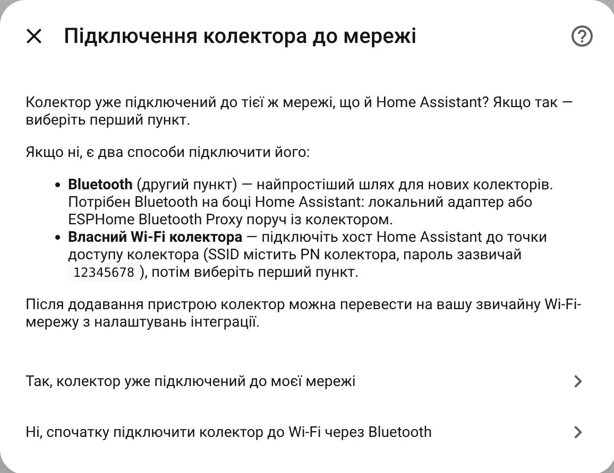
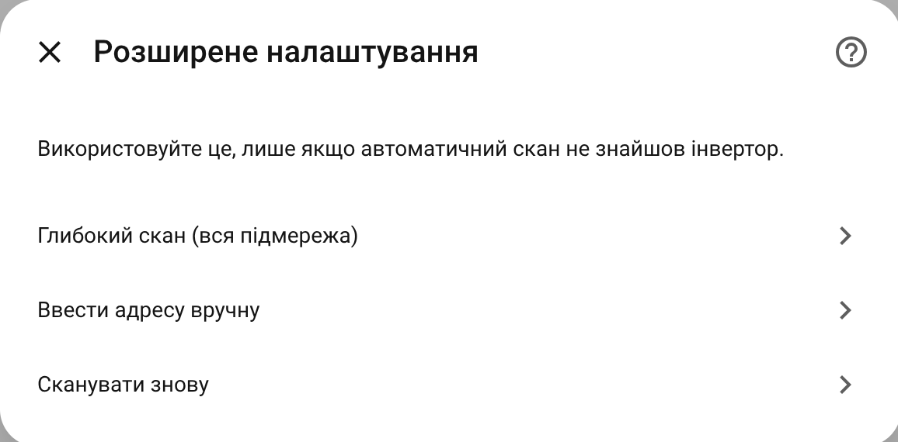
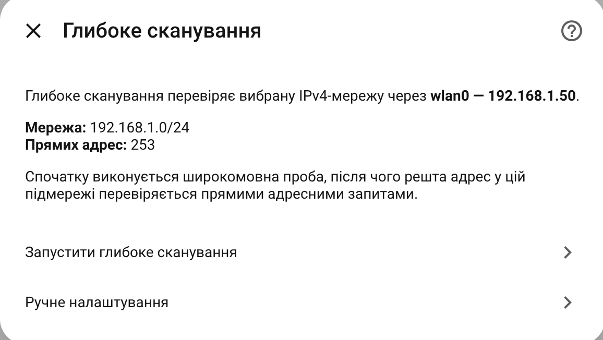
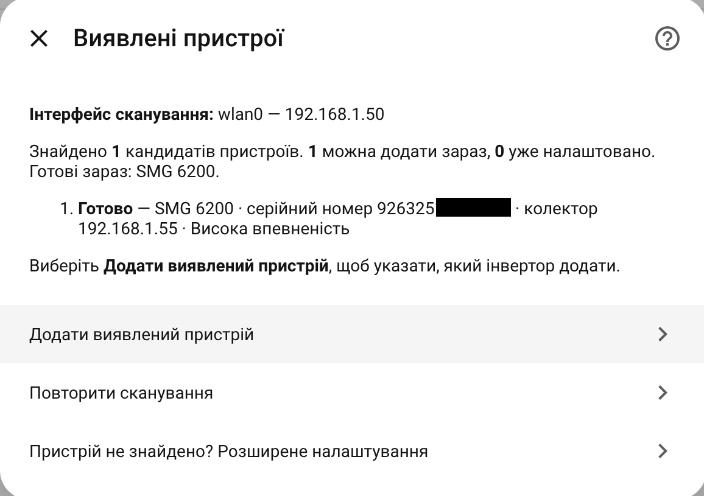
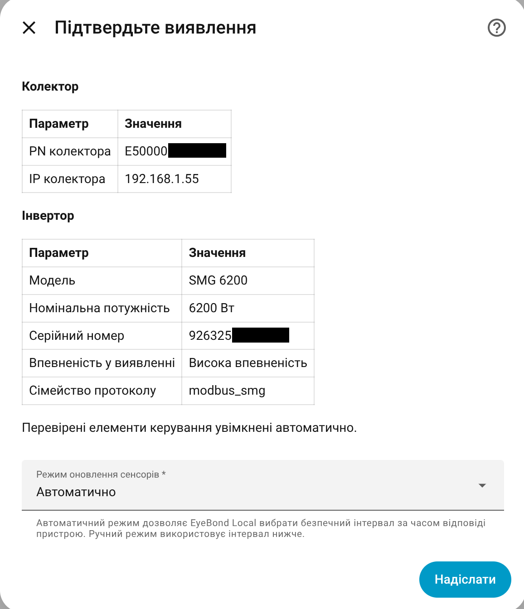
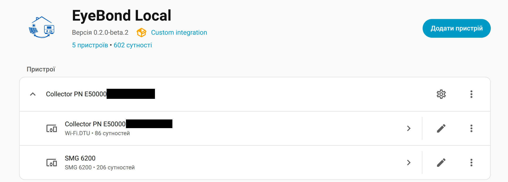
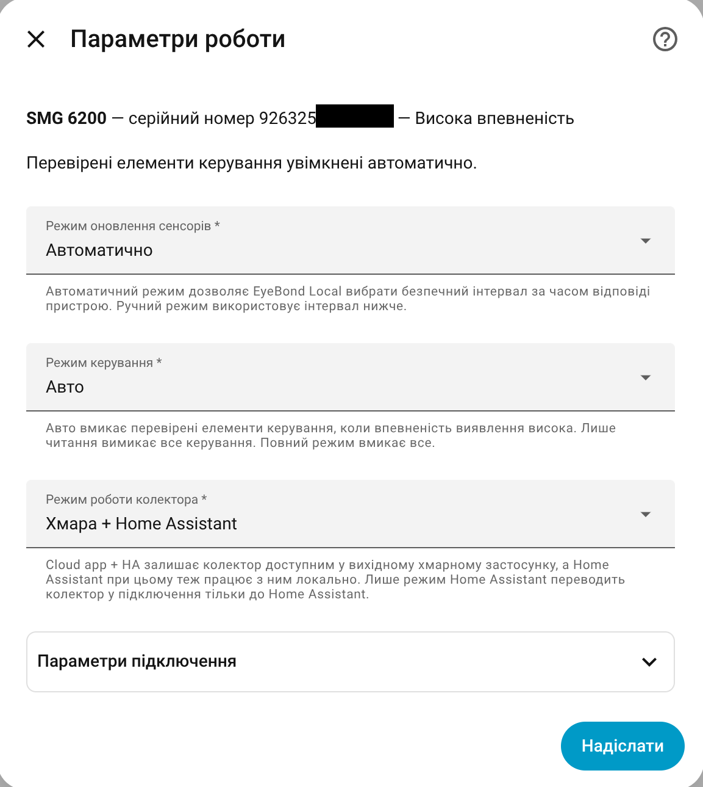

# EyeBond Local — локальна інтеграція Home Assistant для інверторів SmartESS / SmartValue

[English](README.md)

> **Картка для панелі керування:** [EyeBond Local Card](https://github.com/groove-max/ha-eybond-local-card) додає готову панель Home Assistant з потоками енергії та графіками.

> **Немає заводського колектора?** [ESP EyeBond Collector](https://github.com/groove-max/esp-eybond-collector) — спільнотна прошивка-міст для підключення підтримуваних інверторів напряму до EyeBond Local без заводського хмарного реєстратора.

**EyeBond Local** — це локальний моніторинг і керування в Home Assistant для гібридних сонячних інверторів, які використовують EyeBond-сумісні Wi-Fi-колектори та відображаються в застосунках SmartESS / SmartValue.

Використовуйте, якщо ваш інвертор уже працює в застосунку SmartESS або SmartValue, а ви хочете локальний доступ через LAN із Home Assistant, а не залежати лише від хмари виробника.

Вона читає дані інвертора через локальну мережу. Для підтримуваних моделей також доступне безпечне керування: ліміти заряду, режим виходу, звуковий сигнал та інші налаштування, які підтримує саме ваш інвертор.

> **Примітка:** Інтеграція активно розвивається. Частина інверторів підтримується повністю, частина — лише для читання, а для частини потрібен архів підтримки.

---

## Чи підходить ця інтеграція для мого інвертора?

Імовірно так, якщо:

- ваш інвертор відображається в застосунку SmartESS або SmartValue;
- він підключений через зовнішній або вбудований EyeBond-сумісний Wi-Fi-колектор;
- ви хочете, щоб Home Assistant читав дані інвертора локально через вашу LAN;
- ви хочете сенсори PV, батареї, навантаження, мережі та енергії в Home Assistant;
- вам потрібне опційне локальне керування на підтримуваних, перевірених моделях.

Часто цей проєкт шукають як інтеграцію SmartESS для Home Assistant, інтеграцію
SmartValue для Home Assistant, підключення EyeBond Wi-Fi-колектора, або за брендами
на кшталт Anenji, PowMr і Sandisolar — а також як локальний моніторинг сонячного
інвертора без хмари виробника. Повний, завжди актуальний список — у
[каталозі моделей інверторів](docs/generated/INVERTER_MODEL_CATALOG.generated.md).

---

## Що вміє інтеграція

- Читає дані інвертора, батареї, PV, навантаження та мережі локально.
- Створює звичайні сутності Home Assistant: сенсори, числа, списки вибору, перемикачі та кнопки.
- Підтримує два режими колектора:
  - **Хмара + Home Assistant** — застосунок виробника і Home Assistant працюють разом.
  - **Тільки Home Assistant** — колектор працює лише з Home Assistant.
- Дає вибрати рівень керування:
  - **Лише читання** — тільки моніторинг.
  - **Автоматично** — перевірене керування вмикається саме.
  - **Повне керування** — ручне відкриття доступних елементів керування для досвідчених користувачів.
- Може створити **архів підтримки**, якщо пристрій потребує діагностики або додавання підтримки.
- Працює з додатковою карткою [EyeBond Local Card](https://github.com/groove-max/ha-eybond-local-card).

---

## Чому локально, а не лише через хмару виробника?

EyeBond Local спілкується з підтримуваними колекторами через вашу локальну мережу,
тож щоденний моніторинг не залежить від доступності хмари виробника. Оновлення
надходять на локальній швидкості, а дані інвертора лишаються у вашій інсталяції
Home Assistant.

На підтримуваних колекторах можна одночасно залишити застосунок SmartESS або
SmartValue робочим (режим **Хмара + Home Assistant**) або перемкнути колектор на
роботу лише з Home Assistant (режим **Тільки Home Assistant**).

---

## Підтримуване обладнання

EyeBond Local призначена для інверторів, які використовують EyeBond-сумісні Wi-Fi-колектори. Це може бути окремий колектор або вбудований Wi-Fi-модуль.

Серед протестованих моделей — пристрої, що продаються під брендами Anenji, PowMr,
Sandisolar, LVYUAN, MUST і Yingfa, а також пристрої протокольних родин SMG, PI18,
PI30 та SRNE. Рівень підтримки залежить від моделі, і інші бренди на тих самих
колекторах теж можуть працювати.

Поточний список моделей:

- [Каталог моделей інверторів](docs/generated/INVERTER_MODEL_CATALOG.generated.md)

Під час налаштування інтеграція показує, що вдалося визначити:

- **Підтримується** — нормальний моніторинг і підтверджене керування.
- **Обмежена / часткова підтримка** — моніторинг працює, але частина сенсорів або керування може бути відсутня.
- **Лише читання** — моніторинг працює, керування вимкнене.
- **Невідомий пристрій** — для перевірки потрібен архів підтримки.

Якщо вашої моделі немає у списку, вона все одно може працювати. Додайте пристрій, створіть архів підтримки й відкрийте звернення на GitHub.

### Немає заводського колектора?

Якщо у вашого інвертора немає заводського колектора, можна використати спільнотний [ESP EyeBond Collector](https://github.com/groove-max/esp-eybond-collector).

Це невеликий міст на ESP8266/ESP32, який підключається до інвертора і працює з цією інтеграцією локально. Оскільки він не використовує хмару виробника, доступні тільки локальні функції Home Assistant.

---

## Встановлення

### Через HACS

1. Відкрийте **HACS → Інтеграції**.
2. Натисніть меню → **Користувацькі репозиторії**.
3. Додайте `https://github.com/groove-max/ha-eybond-local` як **інтеграцію**.
4. Знайдіть **EyeBond Local** і натисніть **Завантажити**.
5. Перезапустіть Home Assistant.
6. Перейдіть у **Налаштування → Пристрої та служби → Додати інтеграцію** і знайдіть **EyeBond Local**.

### Ручне встановлення

1. Завантажте останній реліз.
2. Скопіюйте `custom_components/eybond_local/` у `config/custom_components/`.
3. Перезапустіть Home Assistant.
4. Додайте **EyeBond Local** через **Налаштування → Пристрої та служби**.

---

## Налаштування

Майстер налаштування спочатку знаходить колектор, а потім підтверджує інвертор.

### 1. Підключіть колектор до тієї самої мережі

Якщо колектор уже в тій самій Wi-Fi/LAN-мережі, що й Home Assistant, продовжуйте.

Якщо ні — скористайтеся застосунком виробника, ручним налаштуванням Wi-Fi або
Bluetooth-налаштуванням, якщо ваш колектор це підтримує.

### 2. Проскануйте мережу

Виберіть мережевий інтерфейс Home Assistant і запустіть пошук. Швидке сканування зазвичай займає кілька секунд.

Якщо швидке сканування нічого не знайшло, відкрийте розширене налаштування, щоб запустити глибше сканування або ввести адресу колектора вручну.

### 3. Перевірте результат

Майстер може показати:

- **Готово** — пристрій знайдено і його можна додати.
- **Потрібна перевірка** — пристрій знайдено, але результат варто переглянути.
- **Лише колектор** — колектор відповів, але інвертор ще не визначено впевнено.

### 4. Підтвердьте виявлення та режим оновлення

Підтвердьте знайдений пристрій і виберіть, як мають оновлюватися сенсори.

Режим колектора налаштовується пізніше в **Підключення та опитування**, після
того як інтеграція створить пристрій і прочитає можливості колектора.

Ручне налаштування доступне, коли автоматичний пошук не підходить.

> **Порада:** Автопошук найкраще працює, коли Home Assistant і колектор у тій самій мережі.

---

## Після налаштування

EyeBond Local зазвичай створює два пристрої Home Assistant:

- **Колектор** — Wi-Fi, мережеві дії, режим колектора, перезапуск, архів підтримки та дії для діагностики.
- **Інвертор** — сенсори, лічильники енергії, стани та підтримуване керування.

На пристрої інвертора можуть бути:

- сенсори PV, навантаження, батареї, інвертора та мережі;
- лічильники енергії для панелі енергії Home Assistant;
- аварії, помилки та режим роботи;
- безпечне керування, яке підтримує саме ваша модель;
- режим оновлення сенсорів: **Автоматичний** дозволяє інтеграції вибрати
  безпечний інтервал за часом відповіді пристрою; **Ручний** використовує
  фіксований інтервал від `2` до `3600` секунд.

Режим колектора, режим керування та режим оновлення сенсорів можна змінити
пізніше в **Підключення та опитування**.

В автоматичному режимі EyeBond Local залишає невелику паузу між циклами
опитування та враховує обмеження конкретного протоколу. Наприклад, швидкі
Modbus-пристрої можуть оновлюватися частіше, ніж повільніші ASCII-пристрої.
У ручному режимі діагностичні сенсори **Poll Utilization**, **Poll Duration**
і **Recommended Poll Interval** показують, чи реалістичний вибраний інтервал;
якщо завантаження опитування стабільно високе, збільште інтервал або
поверніться до автоматичного режиму.
**Poll Context** показує, чи поточний цикл читає інвертор, шукає інвертор або
лише перевіряє колектор, щоб довгі цикли пошуку не плуталися зі звичайним
опитуванням під час роботи.

---

## Навчання пристрою

Деякі пристрої спочатку додаються в режимі лише читання або часткової підтримки. **Додати керування (навчання пристрою)** може перевірити, які додаткові налаштування та сенсори підтримує саме ваш пристрій.

Використовуйте це, коли:

- інтеграція пропонує це для вашого пристрою;
- моніторинг працює, але керування відсутнє;
- розробник попросив запустити навчання для додавання моделі.

Що відбувається:

1. Відкрийте **Налаштувати → Додати керування (навчання пристрою)**.
2. Прочитайте попередження про безпеку.
3. Увійдіть у підтримуваний хмарний акаунт для цього одного сеансу, якщо
   майстер попросить це зробити. Для багатьох заводських колекторів це той
   самий акаунт, який використовується у SmartESS / SmartValue або іншому
   сумісному застосунку виробника.
4. Дочекайтеся перевірки доступних налаштувань.
5. Перегляньте знайдені елементи перед застосуванням.

Хмарний пароль не зберігається. Знайдені елементи застосовуються тільки до
цього пристрою Home Assistant, доки їх не буде перевірено і додано до
вбудованого каталогу.

Якщо щось виглядає небезпечно або незрозуміло, зупиніться і створіть архів підтримки.

Повний опис: [Навчання пристрою](docs/DEVICE_LEARNING.md).

---

## Як отримати допомогу

Якщо щось не працює:

1. Відкрийте інтеграцію в **Налаштування → Пристрої та служби**.
2. Натисніть **Налаштувати → Діагностика та сервісні інструменти**.
3. Натисніть **Створити архів підтримки**.
4. Відкрийте [звернення на GitHub](https://github.com/groove-max/ha-eybond-local/issues) і прикріпіть ZIP.

Архів підтримки — найкращий спосіб повідомити про непідтримуване обладнання, помилку налаштування, відсутні сенсори або відсутнє керування.

Детальніше: [Архів підтримки](docs/SUPPORT_ARCHIVE.md).

Шаблони звернень:

- **Повідомлення про помилку** — щось зламалося на вже підтримуваному обладнанні.
- **Архів підтримки / діагностика обладнання** — нове обладнання, невдале налаштування, відсутні сенсори або керування.
- **Дані про пристрій** — поділіться результатом навчання частково підтримуваного або нерозпізнаного пристрою разом з архівом підтримки, щоб додати його до вбудованого каталогу.
- **Запит функції** — покращення інтерфейсу або нові можливості.

---

## Усунення проблем

| Проблема | Що спробувати |
|---|---|
| Автопошук нічого не знаходить | Виберіть інший мережевий інтерфейс, потім повторіть швидке або глибоке сканування. За потреби використайте ручне налаштування з IP колектора з роутера. |
| Bluetooth Wi-Fi недоступний | Переконайтеся, що Home Assistant має Bluetooth поруч із колектором. Може допомогти ESPHome Bluetooth Proxy біля колектора. |
| Пристрій лишається в стані очікування налаштування | Зачекайте кілька хвилин, оновіть сторінку пристрою, потім повторіть сканування або ручне налаштування. Якщо не допомогло — створіть архів підтримки. |
| Статус **Лише колектор** | Колектор відповів, але інвертор не визначено впевнено. Створіть архів підтримки. |
| Сенсори недоступні | Перевірте, що колектор і Home Assistant у тій самій мережі, а Wi-Fi колектора стабільний. |
| Застосунок виробника перестав показувати дані | Перевірте режим колектора. **Тільки Home Assistant** навмисно відключає цей колектор від хмари. Перемкніть назад на **Хмара + Home Assistant**, якщо потрібен застосунок виробника. |
| Застосунок виробника працює, а Home Assistant показує недоступність | Колектор міг швидше відновити зв'язок із хмарою, ніж локально з Home Assistant. Зачекайте кілька хвилин і перевірте Wi-Fi. |
| Налаштування одразу повертається назад | Інвертор відхилив значення або не підтвердив зміну. Не змінюйте той самий параметр у застосунку виробника одночасно й повторіть після стабілізації колектора. |
| Потрібне віддалене підключення | Дивіться [посібник з віддаленого підключення / NAT](docs/REMOTE_SETUP.md). За можливості використовуйте VPN замість відкриття порту в інтернет. |
| Немає керування | Для нормального використання залишайте **Автоматично**. Якщо моніторинг працює, але керування відсутнє, запустіть навчання пристрою, якщо воно доступне, або створіть архів підтримки. **Повне керування** використовуйте лише якщо розумієте ризик. |

---

## Документація

- [Покажчик документації](docs/README.md)
- [Керування колектором](docs/COLLECTOR_MANAGEMENT.md)
- [Навчання пристрою](docs/DEVICE_LEARNING.md)
- [Архів підтримки](docs/SUPPORT_ARCHIVE.md)
- [Віддалене підключення / NAT](docs/REMOTE_SETUP.md)
- [Захоплення трафіку колектора](docs/PROXY_CAPTURE.md) — використовуйте лише коли просять під час підтримки
- [Каталог моделей інверторів](docs/generated/INVERTER_MODEL_CATALOG.generated.md)
- [Як допомогти проєкту](CONTRIBUTING.md)

---

## Ліцензія

Ліцензовано під [MPL-2.0](LICENSE).
