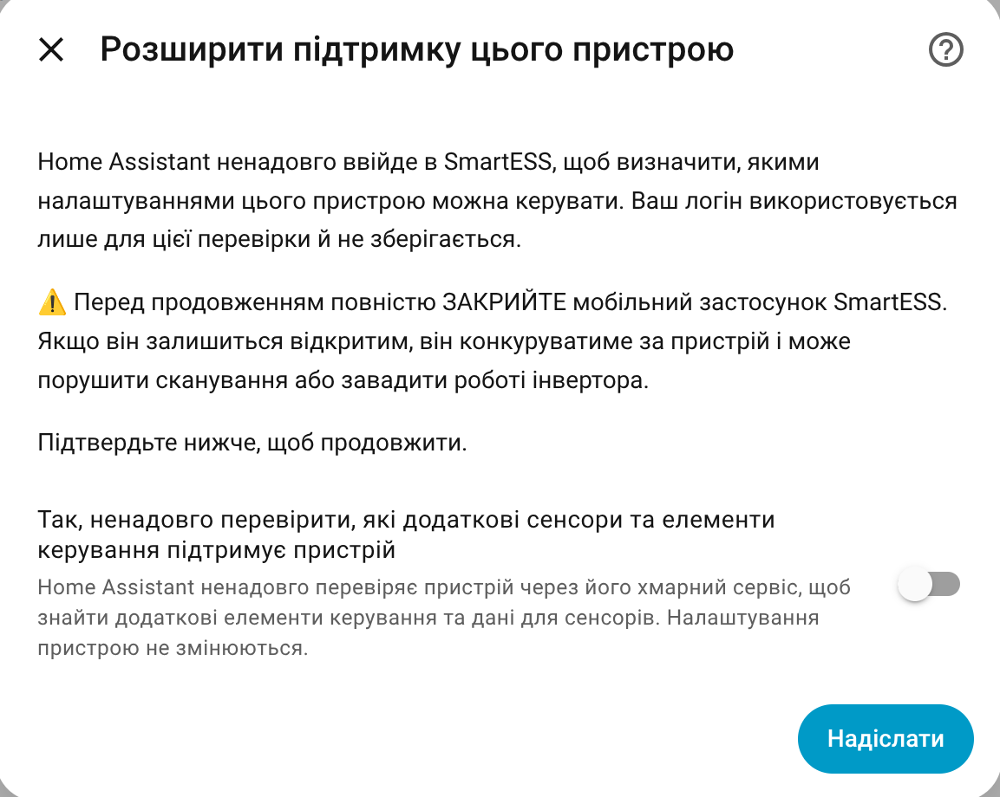
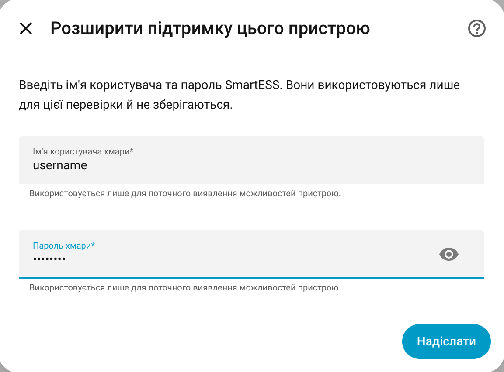
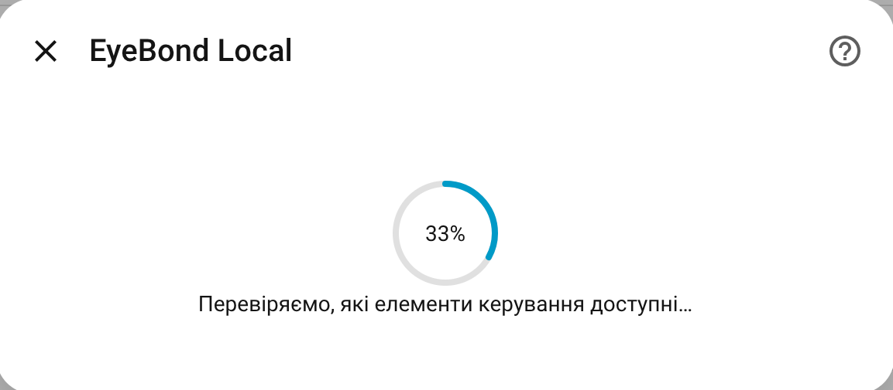

# Device Learning

Device learning is an advanced support flow for inverters that work in Home Assistant, but do not yet have full built-in support.

Most users do not need to run it. Use it when the integration offers it for your device, or when a developer asks for it while adding support for your model.

## What it can help with

Device learning can find extra items that are known to the supported cloud
provider for your exact inverter:

- additional read-only sensors;
- selectable settings;
- numeric settings;
- switches;
- simple button-like actions.

After the scan, Home Assistant shows what was found and lets you choose what to enable.

## When to use it

Use device learning when:

- monitoring works, but controls are missing;
- the model is shown as partially supported;
- the device was added as read-only, but the integration offers learning;
- a developer asks you to run it and share the result.

Do not use it just to “see what happens” on a fully supported inverter. If the device already has confirmed support, learning usually adds no value.

Do not use it when only the collector was found and no inverter was detected. In that case, check the inverter connection first and create a Support Archive if it still cannot be identified.

## Before you start

Check these first:

- The collector has stable Wi-Fi.
- Home Assistant can read live data from the inverter.
- You know the cloud/app username and password for this device, if the learning
  flow asks for them.
- The mobile app for the same cloud account is closed while learning runs.
- You are near the inverter or can safely check it afterward.

If the inverter powers critical loads, run learning only when it is safe to recover manually.

## How to start

1. Open **Settings → Devices & Services**.
2. Open **EyeBond Local**.
3. Click **Configure**.
4. Choose **Add controls (device learning)**.
5. Read the safety notice.

6. Enter the supported cloud/app credentials for this one session, if the flow
   asks for them.

7. Wait for the scan to finish.

8. Review the discovered items before applying them.

The cloud/app password is not saved.

## What happens during learning

In plain terms:

1. Home Assistant starts a temporary safe learning session.
2. It signs in to the supported cloud provider with the credentials you entered.
3. It asks the provider which settings and fields the cloud knows for this
   device.
4. It observes how those cloud items map to the local inverter connection.
5. It blocks unsafe or unknown traffic instead of letting it reach the real inverter.
6. It builds a local result for review.

The goal is to learn what the device supports without permanently changing inverter settings.

If the safe learning path is not ready, the integration stops instead of continuing.

## Review screen

The review screen separates discovered items into choices you can make.

Typical behavior:

- safer controls may be selected by default;
- risky or destructive actions are left off by default;
- read-only sensors can be applied separately from controls;
- you can leave everything disabled and still export evidence for support.

If you do not recognize a setting, leave it disabled.

## What “Apply” does

Applying the result enables the selected learned items for this one Home Assistant device.

This is called a device-scoped learned overlay:

- it affects only this configured device;
- it is not the same as built-in model support;
- it can be removed or replaced later;
- it gives the maintainer evidence for improving the built-in catalog.

For the model to become supported for everyone, the learned result still needs review and catalog work.

## Sharing the result

If you are helping add support for a model:

1. Run device learning.
2. Apply only the items you trust, or apply none if you only want to collect evidence.
3. Create a **Support Archive**.
4. Attach the ZIP to the GitHub issue.

The Support Archive includes the relevant learning evidence.

## If learning fails

Common causes:

- The cloud/app username or password was rejected.
- The collector went offline or reconnected during the scan.
- The safe learning session could not be confirmed.
- The device protocol is not supported by learning yet.
- Home Assistant does not have enough free memory to run the scan safely.

What to do:

1. Do not repeat the scan immediately if the error mentions a safety stop.
2. Check the inverter state, especially output on/off state and important settings.
3. Make sure the vendor app for the same account is closed.
4. Make sure the collector Wi-Fi is stable.
5. Create a Support Archive and attach it to the issue.

## ESP EyeBond Collector note

Device learning depends on a supported cloud provider knowing the device.

The ESP EyeBond Collector is local-only and does not have a cloud side, so
device learning is normally not available for it.
