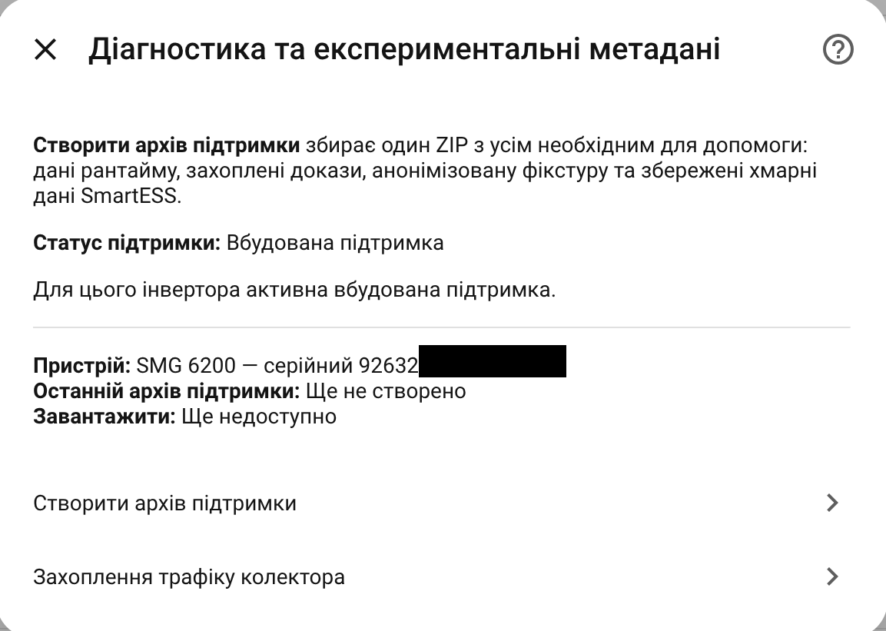
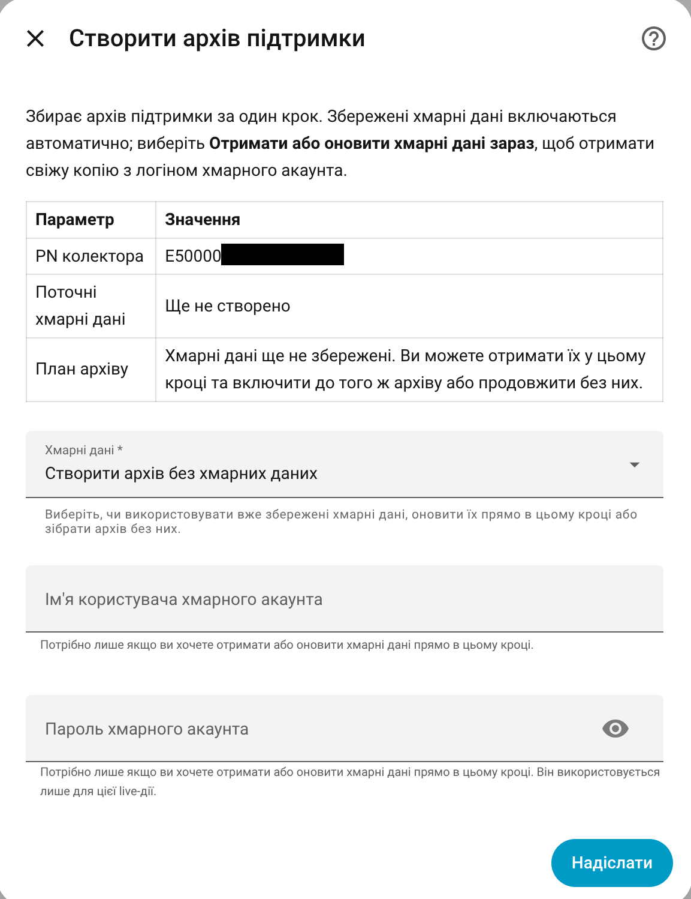

# Support Archive

A Support Archive is the best way to report a device that does not work correctly with EyeBond Local.

It creates one ZIP file with the information needed to understand the problem without asking you to copy many separate screenshots or logs.

## When to create one

Create a Support Archive when:

- setup fails;
- the device stays in **EyeBond Setup Pending**;
- the device is shown as **Collector only**;
- sensors are missing or unavailable;
- controls are missing;
- a control is rejected by the inverter;
- a developer asks for diagnostics in a GitHub issue;
- you ran device learning and want to share the result.

For unsupported or partially supported hardware, always attach a Support Archive to the issue.

## How to create it

1. Open **Settings → Devices & Services**.
2. Open **EyeBond Local**.
3. Click **Configure**.
4. Open **Diagnostics and service tools**.

5. Choose **Create support archive**.

6. Download the generated ZIP.
7. Attach it to the GitHub issue.

## What to include in the issue

Along with the ZIP, write a short description:

- inverter commercial model name, if known;
- what you expected to happen;
- what actually happened;
- whether the vendor app still works, if you use one;
- whether controls were enabled, missing, or rejected;
- what action you tried right before creating the archive.

This short context is often as important as the archive itself.

## What the archive is for

The archive helps answer questions such as:

- Which collector and inverter path was detected?
- Did Home Assistant receive live data?
- Which support tier was selected?
- Which sensors and controls were available?
- Did device learning produce useful evidence?
- Did the inverter reject a setting?
- Is this a known model, a known family fallback, or a new variant?

## Privacy expectations

The archive is intended for sharing with the maintainer in a GitHub issue.

It avoids obvious secrets where possible, but it can still contain technical identifiers needed for support. Before posting publicly, do not add extra screenshots or files that include passwords, private IP notes, vendor-app account details, or serial/account information you do not want to share.

If the case contains sensitive information, say so in the issue and share only the minimum needed publicly.

## Cloud credentials

Creating a normal Support Archive does not require your cloud/app password.

Some optional support actions can refresh cloud evidence and may ask for
credentials for SmartESS / SmartValue or another compatible vendor app for that one action.
The password is used only for the live request and is not saved by the
integration.

## Support Archive vs proxy capture

Use **Support Archive** first.

Use **Proxy Capture** only when a developer asks for it. Proxy capture records one temporary collector session and is more advanced. It does not replace the normal Support Archive.

## Support Archive after device learning

If you ran **Add controls (device learning)**, create a Support Archive afterward.

That gives the maintainer the learning result and enough context to decide whether the discovered sensors or controls can be added to the built-in model catalog.
