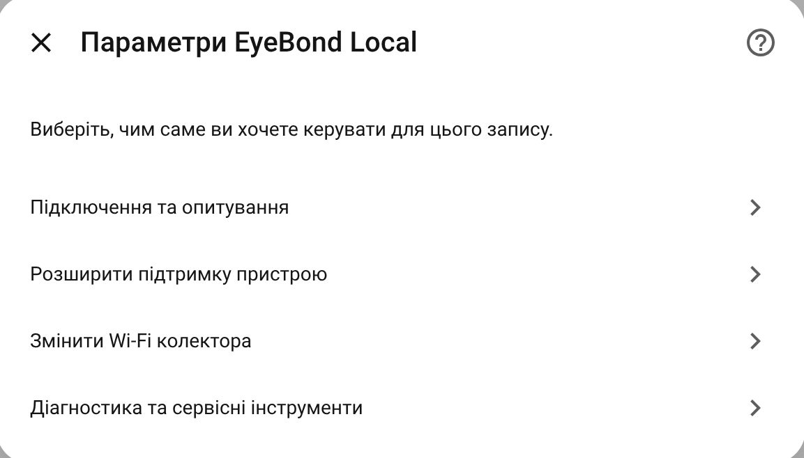

# Collector Management

This guide explains the collector side of EyeBond Local: what the collector device is for, which mode to choose, and which actions are meant for normal use.

## Collector and inverter devices

EyeBond Local usually creates two devices in Home Assistant for one installation:

- the **collector device**, which holds network, connection, and troubleshooting actions
- the **inverter device**, which holds the live power, battery, PV, and control entities you use day to day

If you are looking for Wi-Fi, reconnect, proxy capture, or collector mode settings, start with the collector device.

## Getting the collector online

The collector should be on the same network as Home Assistant before normal setup.

Common ways to do this:

- Use the vendor app, such as SmartESS / SmartValue, to connect the collector to Wi-Fi.
- Use EyeBond Local Bluetooth Wi-Fi setup, if your collector supports it.
- Connect to the Wi-Fi access point broadcast by the collector, then run setup from there.

The collector access point name usually contains the collector identifier. Some collectors use `12345678` as the default access-point password.

After the device is added, you can change the collector Wi-Fi from the collector device page.

If you change the collector network and it receives a new IP address, keep the
existing entry. Wait for the collector to reconnect, then reload the entry if
needed. If it stays offline, run normal or background discovery so EyeBond Local
can observe the same collector identity on its new route. Removing the entry is
a last resort because it also removes the established device relationship.

For initial setup, scan result meanings, and background discovery, see
[Setup and Discovery](SETUP_AND_DISCOVERY.md).

## Collector connection and cloud

The normal user choice describes the result you want, not an internal polling
method:

### Cloud + Home Assistant

Choose this when the collector should remain usable in its vendor cloud or app,
such as SmartESS or SmartValue.

- the collector normally keeps its external cloud endpoint
- Home Assistant asks it to connect when local data is needed
- the vendor app can continue receiving data

### Home Assistant only

Choose this when the collector should connect directly to Home Assistant.

- Home Assistant keeps a permanent collector connection
- normal cloud reporting stops
- a previously confirmed external endpoint is remembered when possible so a
  later verified switch can offer it for restoration

The implementation still records a connection strategy internally, but it is
not a separate user mode. Polling and inverter detection are configured on
their own screen.

### Changing the operating profile

Use **Configure → Collector connection and cloud** for normal switching. This
is a verified endpoint transaction, not just a saved preference:

1. Home Assistant shows the endpoint it will use and asks for confirmation.
2. The collector is reconfigured through its current trusted session.
3. Home Assistant accepts the change only after the same collector identity
   returns on the expected connection path.
4. If activation is interrupted after proof was saved, the options menu offers
   a recovery or load-only continuation instead of silently starting over.

Advanced endpoint actions and services exist for recovery and developer use,
but they are not a second operating-profile selector. Polling and inverter
detection remain on their own screen.

> The older writable **Collector Operation Mode** is retired. The similarly
> named sensor is now a read-only operating-profile view and reports a custom
> configuration when the saved architecture does not safely match either
> normal profile.

### When the collector does not call back

If you use **Cloud + Home Assistant** and the collector never appears after a
connection request, the diagnostics report a clear reason:

- **callback timeout** — the collector did not answer in time. Check the network
  path, the server the collector points at, and any firewall in between.
- **identity mismatch** — a *different* collector answered. Check you are
  targeting the right collector.
- **already bound to another entry** — this collector is already owned by
  another Home Assistant entry; remove the duplicate.

## Control mode is a different setting

Do not confuse **Collector connection and cloud** with **Control Mode**.

- **Collector connection and cloud** decides whether the collector normally
  uses its cloud service or connects directly to Home Assistant.
- **Control Mode** decides how much write access Home Assistant gets on the inverter side.

The control modes are:

- **`Read-only`** — monitoring only
- **`Auto`** — verified controls appear automatically when detection confidence is high
- **`Full Control`** — expose available controls manually for advanced users who understand the risk

For most people, leaving the detected operating profile unchanged and using
`Auto` control mode is the safest normal setup.

## Everyday collector actions

The collector device can expose a few practical actions.

### Change collector Wi-Fi

Use this when the collector must join a different SSID or when you are moving it to another router or access point.

- enter the new SSID and password
- apply the new settings
- expect the collector to reconnect, sometimes on a new IP address

Keep the existing entry after a Wi-Fi change. The collector identity, not its
old IP address, is the durable device key. Wait for reconnect and reload the
entry; use discovery only if the new route is not observed automatically.

### Restart collector

Use this after changing collector networking, or when the collector stopped responding and you want a quick reconnect without power-cycling hardware.

The action is available only when the collector's current connection has a
negotiated local management channel. Home Assistant sends the restart through
that exact active connection. Setup and connection-recovery flows additionally
wait for the collector to disconnect and reconnect with the same identity before
accepting the operation as a successful recovery.

If the restart button is unavailable, the current session has not negotiated a
management adapter that can safely send the command. This is a capability
decision for the live session, not a guess based on the collector model.

### Change inverter UART speed

This option appears only when the collector exposes UART management. It changes
the collector-to-inverter baud rate; it does not change the Home Assistant TCP
listener or Wi-Fi settings.

- Use **Refresh UART status** to read the current setting.
- Use **Save UART speed** only when you know the inverter's required baud rate.
- PI30/Voltronic devices commonly use `2400`; SMG/Modbus devices commonly use
  `9600`, but the exact inverter documentation is authoritative.
- A wrong speed can leave the collector online while all inverter entities
  become unavailable. Return to this screen and restore the previous speed.

ESP EyeBond Collector exposes this action when its platform supports runtime
UART changes. BK72xx/LibreTiny builds require changing `baud_rate:` in the
ESPHome YAML and reflashing instead; the options screen reports that limitation.

### Capture collector traffic

This is a support tool. Most users do not need it for normal operation.

Use it only when a developer asks you to collect extra evidence. Open
**Configure → Expand device support → Capture collector cloud traffic**. Duration,
start/stop, live status, and the saved result are owned by this one flow; the
old proxy buttons and duration entity on the collector device are removed.

A new capture can start only while the collector uses the **Cloud + Home
Assistant** profile. If a capture was already started, its stop or recovery
action remains available until the original collector connection is restored.

For the full user guide, see [Collector Proxy Capture](PROXY_CAPTURE.md).

### Run diagnostic commands (advanced)

This is a developer-directed tool for adding or debugging support for a specific model. Most users never need it. It is available under the integration's **Support and diagnostics** menu, and the same tool is available as the `eybond_local.run_diagnostic_commands` action under *Developer Tools → Actions*.

It runs a small scenario of `read` / `write` / `write_bit` / `ascii` commands directly against the inverter over the existing collector connection, and returns the raw result plus a redacted file you can share with a developer. It does **not** change the integration's saved settings, and runs one scenario per device at a time. See [Diagnostic Commands](DIAGNOSTIC_COMMANDS.md) for the complete safety and result-download guide.

> Diagnostic commands run directly on the device. `write` / `write_bit` commands can change its settings, so a scenario that writes is only run when you explicitly enable **Confirm device writes** (`confirm_write`). Only run scenarios a developer gave you.

## Virtual bridge collectors

EyeBond Local also works with the community **[ESP EyeBond Collector](https://github.com/groove-max/esp-eybond-collector)** firmware.

This is useful when your inverter has no factory collector. The ESP bridge connects to the inverter and presents itself to Home Assistant like a collector.

When a bridge is detected:

- It is shown as **ESP EyeBond Collector**.
- Cloud-only actions are hidden because the bridge does not talk to a vendor cloud.
- Collector mode is Home Assistant only.
- **Home Assistant connection address** changes the host and port saved in the
  bridge. Home Assistant applies the address and accepts it only after the same
  collector reconnects.
- If the connected bridge reports its current server address, that address is
  prefilled as an editable suggestion. It is not treated as verification: the
  normal reconnect check still runs before a changed address is saved.
- A callback discovery redirect is not a permanent user mode for this firmware:
  the bridge saves the received Home Assistant address and subsequently connects
  to it on its own.
- Local actions still work: diagnostics, connection settings, Wi-Fi, and UART.

If the integration does not recognize the bridge, update the bridge firmware first.

## When you need advanced networking

If Home Assistant and the collector are on the same LAN, you usually do not need any advanced networking options.

If the collector is remote, behind another router, or must call back through VPN or port forwarding, read the [Remote / NAT Setup Guide](REMOTE_SETUP.md).

For driver detection, Fast versus Full protocol checks, polling, controls, and
disabled entities, see [Runtime Detection and Entities](RUNTIME_AND_INVERTER.md).

## Need help?

If something still does not look right:

1. Open the integration's **Configure** menu.
2. Create a **Support Archive**.
3. Attach the ZIP to a GitHub issue.

That usually gives enough information to understand whether the problem is setup, networking, or model compatibility.
