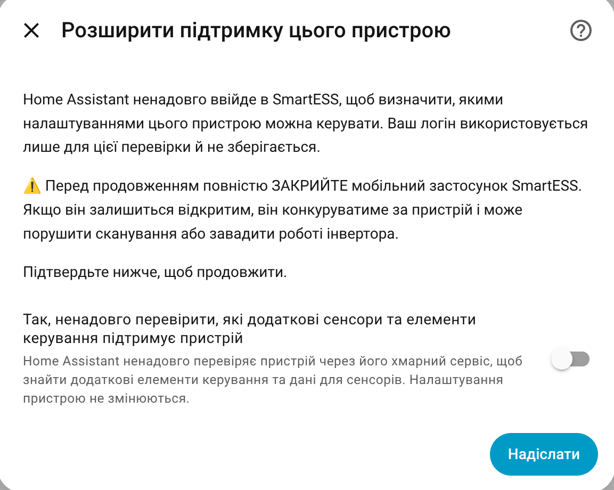
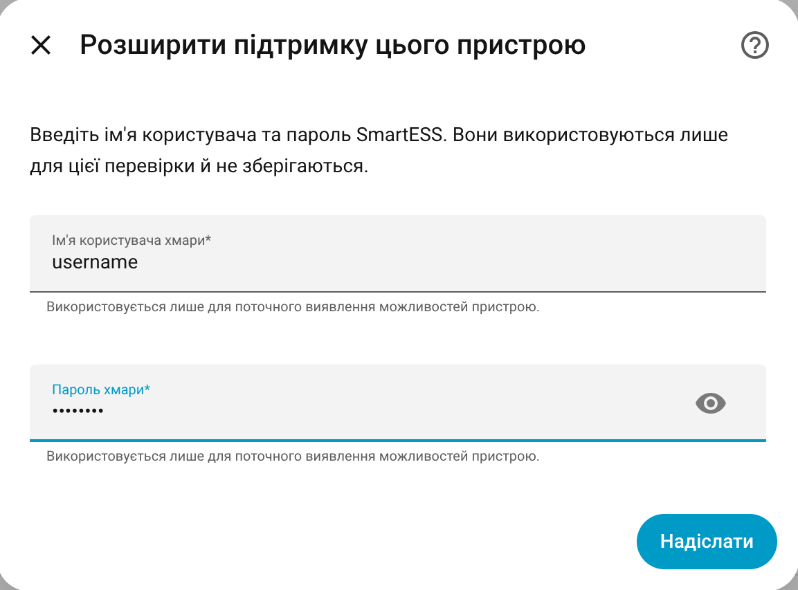
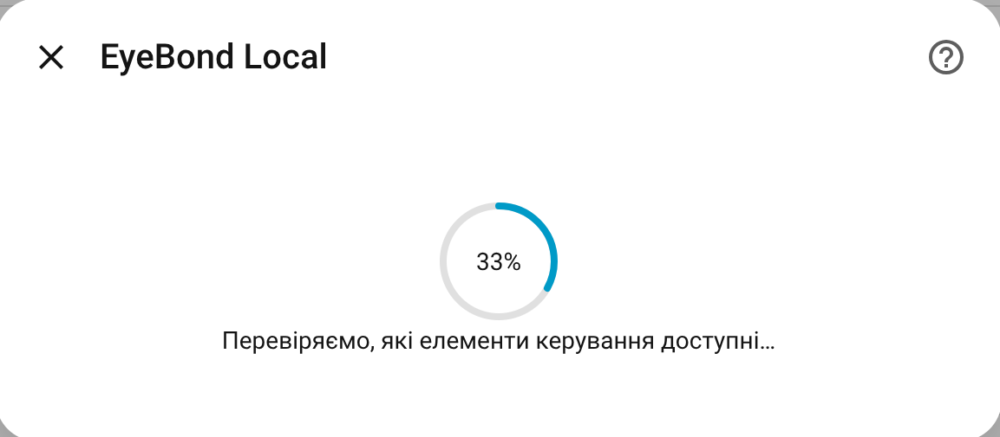

# Device Learning

Device learning is an advanced support flow for inverters that work in Home Assistant, but do not yet have full built-in support.

Most users do not need to run it. Use it when the integration offers it for your device, or when a developer asks for it while adding support for your model.

## What it can help with

Device learning can use more than one information source for your exact
inverter. The flow explains what each available source can do before asking for
credentials. Depending on the selected source, it can find:

- additional read-only sensors;
- selectable settings;
- numeric settings;
- switches;
- simple button-like actions.

Active learning shows locally proven items and lets you choose what to enable. A
read-only metadata check shows information that can help add support later, but
does not create entities until a local register mapping is proven.

Choose the task by the result you need:

| Task | What it does | Can change the device? |
|---|---|---:|
| **Analyze device data** | Collects cloud metadata and available history for support and comparison with local readings. | No |
| **Verify additional local controls** | Temporarily checks whether cloud fields can be matched safely to local reads or controls. | Only inside the protected verification described on screen |

Start with **Analyze device data** unless a developer asks you to verify a
specific control.

## When to use it

Use device learning when:

- monitoring works, but controls are missing;
- the model is shown as partially supported;
- the collector is identified, but runtime has not yet found a supported
  inverter driver and you want to collect read-only evidence for support;
- the device was added as read-only, but the integration offers learning;
- a developer asks you to run it and share the result.

Do not use it just to “see what happens” on a fully supported inverter. If the device already has confirmed support, learning usually adds no value.

Read-only analysis may be available before the inverter is identified. It can
collect identity-bound cloud evidence, but it cannot invent a local driver or a
register mapping. Also check the inverter cable/UART connection and create a
Support Archive if runtime detection still does not complete.

## Before you start

Check these first:

- The collector has stable Wi-Fi.
- For active learning, the collector uses the **Cloud + Home Assistant**
  connection profile. Active learning temporarily routes its cloud traffic
  through Home Assistant under the same protected endpoint transaction used by
  proxy capture, then restores the original cloud endpoint. A read-only metadata
  source does not change the collector endpoint.
- For active verification, Home Assistant can read live data from the inverter.
- You know the cloud/app username and password for this device, if the learning
  flow asks for them.
- The mobile app for the same cloud account is closed while learning runs.
- You are near the inverter or can safely check it afterward.

If the inverter powers critical loads, run learning only when it is safe to recover manually.

## How to start

1. Open **Settings → Devices & Services**.
2. Open **EyeBond Local**.
3. Click **Configure**.
4. Choose **Expand device support**.
5. Choose **Analyze device data** for a read-only check, or **Verify additional
   local controls** only for an advanced active check.
6. If more than one compatible API is offered, choose the exact cloud source.
7. For active verification, read and accept the notice covering the temporary
   endpoint change, bounded cloud test commands, and local interception.
8. Enter the supported cloud/app credentials for this one session, if the flow
   asks for them.
9. Wait for the check to finish. Progress can pause while the selected cloud
   service waits for its next sample or history page; it must never move
   backwards.
10. Review the result. Only active learning can offer locally proven items to
   apply; read-only metadata remains support evidence.

The cloud/app password is not saved.

### Example: SmartESS active verification

The screens below were captured from the SmartESS active-verification path in
an earlier beta. They still illustrate the consent, temporary credential, and
progress stages. Current versions first ask you to choose the learning task and
cloud API, so the exact wording and the screens immediately before these may
differ. Follow the current on-screen text when it differs from an image.

## What happens during learning

Home Assistant first asks what you want to do. Read-only analysis is the
recommended default; control verification is a separate advanced task. If more
than one API can perform the selected task, the next step asks which API to use.
Choosing an API never silently changes the task.

For control verification:

1. Home Assistant signs in to the selected cloud API with the credentials you entered.
2. It verifies the exact device identity and asks which settings and fields the cloud knows for this
   device.
3. Only after that succeeds, it temporarily changes the collector's cloud
   endpoint to a local Home Assistant shadow route.
4. The selected cloud API sends bounded test commands for this exact device.
5. Home Assistant captures the matching local write commands and blocks them
   before they reach the real inverter. If a cloud success cannot be matched to
   a local interception, the run stops as a possible unproxied write.
6. Home Assistant restores the collector's previous cloud endpoint. If that
   restoration cannot be confirmed, the recovery action remains available in
   the same support menu.
7. It builds a local result for review.

This endpoint transaction is the critical part of active verification. The
confirmation checkbox is consent to the temporary rerouting, the bounded cloud
test commands, and their local interception. Read-only analysis does none of
these operations and never changes the collector endpoint.

The currently implemented method/source combinations are:

| Cloud source | Read-only analysis | Active verification |
|---|---:|---:|
| SmartESS API | Yes | Yes |
| DESSMonitor API | Yes | Yes |
| ValueCloud API | No | Yes |

For active verification, the options flow shows only sources compatible with
the cloud family already confirmed for this collector. Before a provider is
confirmed, read-only analysis can still offer registered metadata APIs for the
user to choose explicitly. SmartESS and DESSMonitor remain separate API choices
even when the same credentials work with both. Home Assistant uses only the
source selected for that run; it does not silently retry through another
service.

The goal is to learn what the device supports without permanently changing inverter settings.

If the safe learning path is not ready, the integration stops instead of continuing.

For read-only analysis, Home Assistant signs in, verifies that the
cloud device has the same collector PN, and downloads bounded device metadata
and available daily sensor history. SmartESS and DESSMonitor can provide
history for this workflow. Home Assistant may then offer a separate background
observation of five local snapshots over roughly 20 minutes so timestamped
local samples can be compared with the cloud series. You may close the options
dialog while that observation runs and return later to see its status. This
background step appears only when the selected source supplied usable
timestamped history. It does not redirect the collector, send a control action,
add an entity automatically, or claim a local register mapping.

## Review screen

The review screen separates discovered items into choices you can make.

Typical behavior:

- safer controls may be selected by default;
- risky or destructive actions are left off by default;
- read-only sensors can be applied separately from controls;
- you can leave everything disabled and still export evidence for support.

If you do not recognize a setting, leave it disabled.

## What “Apply” does

Applying the result enables the selected learned items for this one Home Assistant device.

This is called a device-scoped learned overlay:

- it affects only this configured device;
- it is not the same as built-in model support;
- it can be removed or replaced later;
- it gives the maintainer evidence for improving the built-in catalog.

For the model to become supported for everyone, the learned result still needs review and catalog work.

## Sharing the result

If you are helping add support for a model:

1. Run device learning.
2. Apply only the items you trust, or apply none if you only want to collect evidence.
3. Create a **Support Archive**.
4. Attach the ZIP to the GitHub issue.

The Support Archive includes the relevant learning evidence.

## If learning fails

Common causes:

- The cloud/app username or password was rejected.
- The collector went offline or reconnected during the scan.
- The safe learning session could not be confirmed.
- The device protocol is not supported by learning yet.
- Home Assistant does not have enough free memory to run the scan safely.

What to do:

1. Do not repeat the scan immediately if the error mentions a safety stop.
2. Check the inverter state, especially output on/off state and important settings.
3. Make sure the vendor app for the same account is closed.
4. Make sure the collector Wi-Fi is stable.
5. Create a Support Archive and attach it to the issue.

## ESP EyeBond Collector note

Device learning depends on a supported cloud provider knowing the device.

The ESP EyeBond Collector is local-only and does not have a cloud side, so
device learning is normally not available for it.
