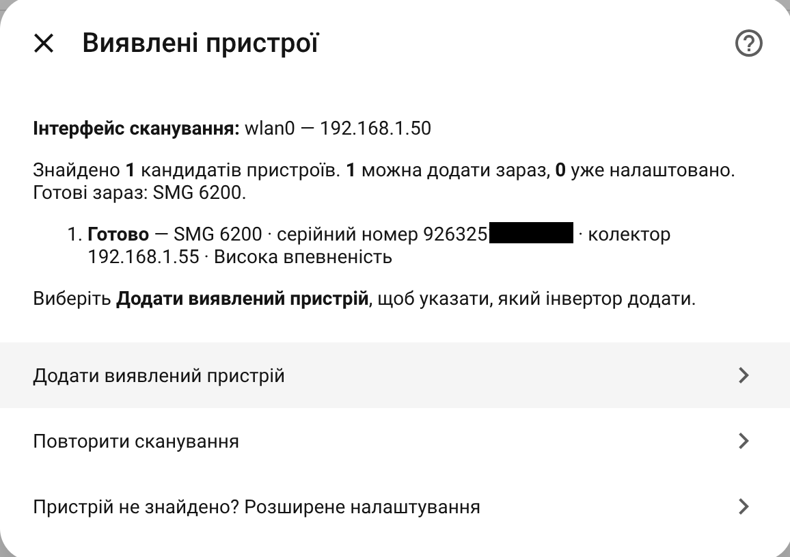
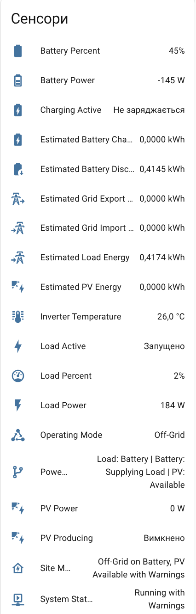

# Interface Screenshot Guide

EyeBond Local evolves quickly, and Home Assistant also changes the way config
flows and device controls are rendered. The screenshots in this repository are
therefore examples of real, supported concepts rather than a promise that every
label and button is in the same place in every release.

For current navigation and behavior, follow the written guides linked from the
[documentation index](../README.md). When the live interface differs from a
screenshot, the current on-screen text and the written guide take precedence.

## Setup flow examples

These earlier beta screens show the same broad setup stages used today: start
the integration, review an identified collector, and confirm the proposed
device. Current setup adds the collector first and lets runtime detection
identify the inverter afterward, so the confirmation screen no longer needs to
contain a fully detected inverter.

The repository also retains `setup-06-detected-devices.png` and
`setup-07-confirm.png` because those stable paths may be used by existing issue
reports and external links. They are exact copies of the two corresponding
screens above, not additional setup stages.

## Settings and proxy controls

The following screens show capabilities that remain supported, although their
navigation changed:

- polling, control, and connection choices are now separated so changing how
  often the inverter is read cannot silently change the collector endpoint;
- the old writable **Collector Operation Mode** was replaced by the verified
  **Collector connection and cloud** flow;
- proxy duration, start/stop, recovery, status, and download are now owned by
  one **Expand device support → Capture collector cloud traffic** flow instead of
  separate device entities.

These images are still useful when reading an older support report or comparing
the previous and current interaction model. They should not be used as the
current click-by-click procedure; see [Collector Management](COLLECTOR_MANAGEMENT.md)
and [Collector Proxy Capture](PROXY_CAPTURE.md) for that.

## Inverter entity examples

The exact entity list depends on the detected inverter driver, firmware,
available measurements, and control mode. These two real examples therefore
show different sets and operating conditions; neither is a mandatory checklist
for every inverter.

