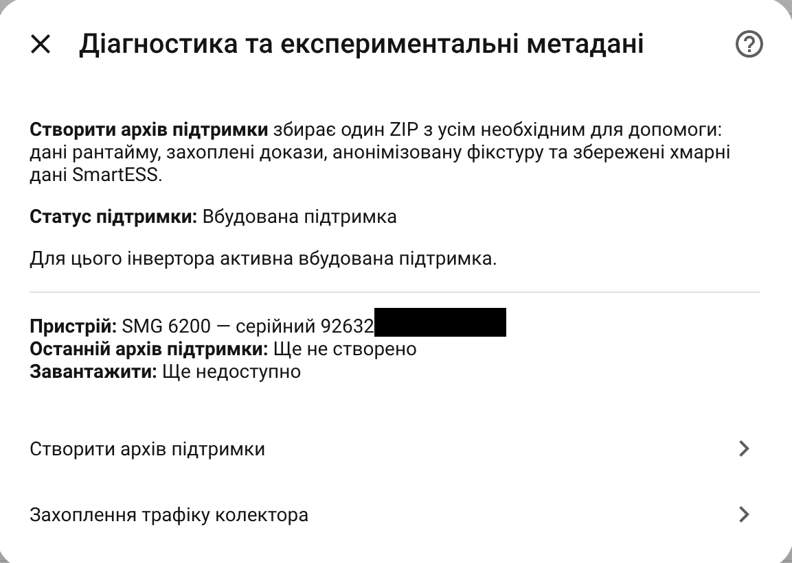
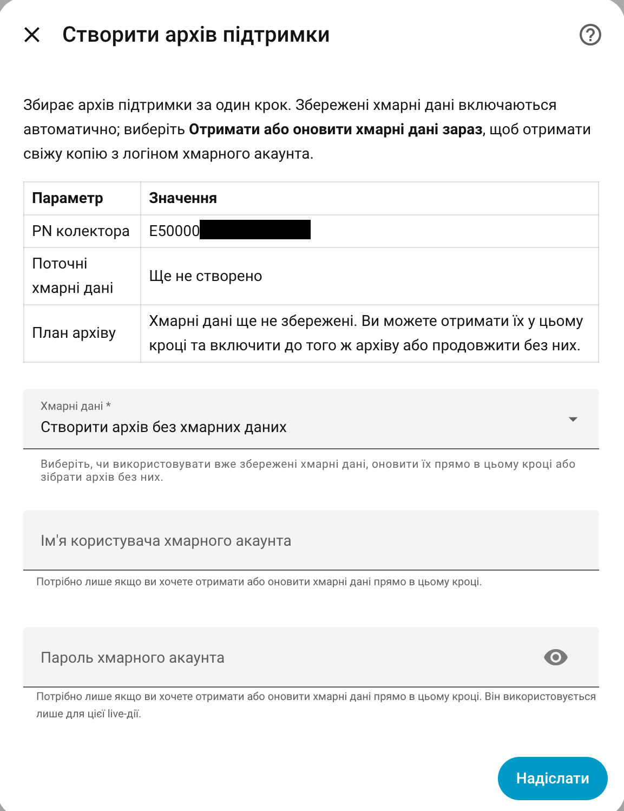

# Support Archive

A Support Archive is the best way to report a device that does not work correctly with EyeBond Local.

It creates one ZIP file with the information needed to understand the problem without asking you to copy many separate screenshots or logs.

## When to create one

Create a Support Archive when:

- setup fails;
- setup repeatedly cannot verify the collector identity or recovery path;
- the collector was added but runtime detection did not identify the inverter;
- sensors are missing or unavailable;
- controls are missing;
- a control is rejected by the inverter;
- a developer asks for diagnostics in a GitHub issue;
- you ran device learning and want to share the result.

For unsupported or partially supported hardware, always attach a Support Archive to the issue.

## How to create it

1. Open **Settings → Devices & Services**.
2. Open **EyeBond Local**.
3. Click **Configure**.
4. Open **Diagnostics and service tools**.

5. Choose **Create support archive**.

6. Download the generated ZIP from the signed link shown by Home Assistant. The
   link is short-lived and scoped to this archive; it is not a public `/local`
   file.
7. Attach it to the GitHub issue.

If the link has expired or returns you to the Home Assistant dashboard, create
the archive again and use the new link. The ZIP is not exposed as a permanent
public file.

## What to include in the issue

Along with the ZIP, write a short description:

- inverter commercial model name, if known;
- what you expected to happen;
- what actually happened;
- whether the vendor app still works, if you use one;
- whether controls were enabled, missing, or rejected;
- what action you tried right before creating the archive.

This short context is often as important as the archive itself.

## What the archive contains

Depending on what is available for this entry, one archive can include:

- integration version and build information;
- collector, session, runtime, polling, and inverter-detection diagnostics;
- the current Home Assistant device and entity layout;
- recent raw protocol evidence used for diagnosis;
- an anonymized replay fixture when one can be built safely;
- device-learning or cloud evidence that already belongs to this entry.

The archive helps answer questions such as:

- Which collector and inverter path was detected?
- Did Home Assistant receive live data?
- Which support tier was selected?
- Which sensors and controls were available?
- Did device learning produce useful evidence?
- Did the inverter reject a setting?
- Is this a known model, a known family fallback, or a new variant?

## Optional cloud evidence

The archive form can offer up to three choices:

- **Use saved cloud evidence** — include the latest matching result already
  stored for this entry.
- **Fetch or refresh cloud evidence now** — sign in once, obtain a fresh result,
  and include it in the same ZIP.
- **Create the archive without cloud evidence** — collect local diagnostics
  only.

Only choices that are valid for the current collector and saved evidence are
shown. Cloud data is optional; a normal Support Archive does not require a
cloud account.

## Privacy expectations

The archive is intended for sharing with the maintainer in a GitHub issue.

Credentials, access tokens, full collector identifiers, and long serial-like
identifiers are removed or masked by the exporter. The archive can still
contain private network addresses, device behavior, live readings, and other
technical context needed to reproduce the problem. Review it before posting it
publicly, and do not add extra screenshots or files containing passwords or
vendor-account details.

If the case contains sensitive information, say so in the issue and share only the minimum needed publicly.

## Cloud credentials

Creating a normal Support Archive does not require your cloud/app password.

The **Fetch or refresh cloud evidence now** choice may ask you to choose a
supported API such as SmartESS, DESSMonitor, or ValueCloud. The available source
depends on the collector's confirmed cloud family. Credentials are used only
for that live request and are not saved by the integration.

## Support Archive vs proxy capture

Use **Support Archive** first.

Use **Proxy Capture** only when a developer asks for it. Proxy capture records one temporary collector session and is more advanced. It does not replace the normal Support Archive.

## Support Archive after device learning

If you ran **Device learning**, create a Support Archive afterward.

That gives the maintainer the learning result and enough context to decide whether the discovered sensors or controls can be added to the built-in model catalog.

## Other diagnostics menu items

- **Run diagnostic commands** executes a developer-provided scenario. Read the
  [Diagnostic Commands](DIAGNOSTIC_COMMANDS.md) guide before using it.
- **Reload local metadata** appears when a local experimental profile or schema
  needs to be reloaded after a developer-directed change.
- **Rollback local metadata** removes active local overrides and returns the
  entry to built-in metadata. Saved evidence and inactive drafts are retained.
- **Collector traffic capture** is a separate advanced workflow. Use it only
  when support asks for it; see [Collector Proxy Capture](PROXY_CAPTURE.md).
